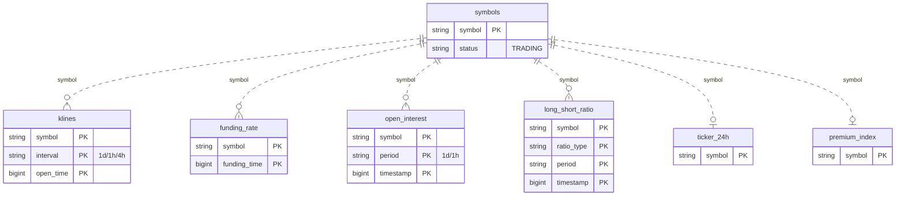

# ba-sync 数据库表结构说明

> 数据库:MySQL `ba`。本服务只负责把币安 U 本位永续合约(USDⓈ-M Futures)数据拉进 MySQL,**不做任何分析**。
> 所有表由 `JdbcDataStore.init()` 用 `CREATE TABLE IF NOT EXISTS` 自动建表(引擎 InnoDB,字符集 utf8mb4)。

## 表间关系总览

7 张表之间**没有数据库外键约束**,唯一的逻辑关联键是 `symbol`:`symbols` 是合约元信息中心表,其余 6 张都按 `symbol`(部分再加 `period`/`interval`/`ratio_type` + 时间戳)挂在它下面。按写入特征分两类:



```
                          ┌────────────────────┐
                          │      symbols        │  合约元信息中心表(每币一行)
                          │  PK: symbol         │  来源 exchangeInfo
                          └─────────┬──────────┘
              按 symbol 逻辑关联(无 FK 约束)
   ┌──────────────┬──────────────┼──────────────┬──────────────┐
   │              │              │              │              │
【历史累积表 · 永不删除 · 主键含时间戳】        【快照表 · 每币一行 · 只留最新】
   │              │              │              │              │
klines        funding_rate   open_interest  long_short_ratio │
(±interval)   (±funding_time)(±period       (±ratio_type     ticker_24h
              时间序列        +timestamp)    +period+ts)      premium_index
```

- **历史累积表**(`klines` / `funding_rate` / `open_interest` / `long_short_ratio`):主键带时间戳,UPSERT 永不删除,序列随时间无限增长。
- **快照表**(`symbols` / `ticker_24h` / `premium_index`):主键仅 `symbol`,每币只保留一行最新值。
- 关系基数:`symbols` 1 ──< N `klines`/`funding_rate`/`open_interest`/`long_short_ratio`(一对多);`symbols` 1 ── 1 `ticker_24h`/`premium_index`(一对一快照)。
  > 注:`ticker_24h` / `premium_index` 来自全市场端点,实际行数会**多于** `symbols`(含非永续等),所以严格说是"近似一对一"。

---

## 全局约定(读所有表前先看)

- **时间戳一律是 UTC 毫秒**(`BIGINT`,Unix epoch ms)。例:`1782518400000` = `2026-06-27 00:00:00 UTC`。
  展示给人看时若按北京时间(UTC+8)会 +8 小时,可能跨日,属正常,不是数据错。
- **价格 / 数量 / 比率字段几乎都存成 `VARCHAR` 字符串**(直接落币安返回的原始文本,避免浮点精度丢失)。
  需要计算时再 `CAST` 成 `DECIMAL`,或由 Java 侧的 model getter 解析成 double。
- **写入策略:全部 UPSERT(`INSERT ... ON DUPLICATE KEY UPDATE`),全项目无任何 `DELETE`。**
  - 历史序列表(klines / funding_rate / open_interest)→ 数据随时间无限累积、**永不删除**,可突破币安原生接口的 30 天 / 条数上限。
  - 快照表(symbols / ticker_24h / premium_index)→ 每个 symbol 只留一行最新值。
  - 副作用:币安下架的合约,历史数据和 `symbols` 行都会**残留**,不会被清理。
- **K 线区间为左闭右开**:`close_time = open_time + 周期 - 1ms`(例 1d:`00:00:00.000` ~ `23:59:59.999`)。

---

## 1. `klines` — K 线 / 蜡烛图(历史累积)

来源:币安 `GET /fapi/v1/klines`。主键 `(symbol, interval, open_time)`。
覆盖 1d / 1h / 4h 三种周期,全部 529 个 USDT 永续。日线那根"当天动态根"由 `refreshCurrentKline` 每个短频周期强制刷新。

| 字段 | 类型 | 含义 |
|------|------|------|
| `symbol` | VARCHAR(20) | 合约名,如 `BTCUSDT`(主键) |
| `interval` | VARCHAR(10) | K 线周期:`1d` / `1h` / `4h`(主键,反引号转义,是 MySQL 保留字) |
| `open_time` | BIGINT | 开盘时间(UTC ms,周期对齐;1d=每天 UTC 00:00)(主键) |
| `open` | VARCHAR(50) | 开盘价 |
| `high` | VARCHAR(50) | 最高价 |
| `low` | VARCHAR(50) | 最低价 |
| `close` | VARCHAR(50) | 收盘价(未收盘的当前根=最新价,会滚动变化) |
| `volume` | VARCHAR(50) | 成交量(以**基础币**计,如 BTC 个数) |
| `close_time` | BIGINT | 收盘时间(UTC ms,= open_time + 周期 - 1ms) |
| `quote_asset_volume` | VARCHAR(50) | 成交额(以**计价币**计,即 USDT 金额) |
| `number_of_trades` | INT | 成交笔数 |
| `taker_buy_base` | VARCHAR(50) | 主动买入量(基础币) |
| `taker_buy_quote` | VARCHAR(50) | 主动买入额(计价币 USDT) |

> 索引:`idx_klines_lookup (symbol, interval, open_time DESC)` —— 取某币某周期最新 N 根。

---

## 2. `funding_rate` — 资金费率(历史累积)

来源:币安 `GET /fapi/v1/fundingRate`。主键 `(symbol, funding_time)`。
永续合约每 8 小时结算一次(UTC 00:00 / 08:00 / 16:00)。

| 字段 | 类型 | 含义 |
|------|------|------|
| `symbol` | VARCHAR(20) | 合约名(主键) |
| `funding_time` | BIGINT | 资金费结算时间(UTC ms)(主键) |
| `funding_rate` | VARCHAR(50) | 资金费率,带符号小数。正=多头付空头,负=空头付多头。如 `0.00012345` 表示 0.012345% |

> 索引:`idx_fr_lookup (symbol, funding_time DESC)`。

---

## 3. `open_interest` — 持仓量 OI(历史累积)

来源:币安 `GET /futures/data/openInterestHist`。主键 `(symbol, period, timestamp)`。
- `period='1d'`:日线 OI,每天北京 08:10 的 `daily-oi-sync` 任务拉取,长期累积(突破币安 30 天上限)。
- `period='1h'`:小时 OI,`mid-freq-sync`(每 30 分)拉取。

| 字段 | 类型 | 含义 |
|------|------|------|
| `symbol` | VARCHAR(20) | 合约名(主键) |
| `period` | VARCHAR(10) | OI 周期:`1d` / `1h`,默认 `1d`(主键) |
| `timestamp` | BIGINT | 该 OI 快照的时间点(UTC ms,周期对齐)(主键) |
| `open_interest` | VARCHAR(50) | 持仓量(以**基础币**计,如未平仓 BTC 张/个数) |
| `sum_open_interest` | VARCHAR(50) | 持仓总量(基础币),币安 hist 接口字段 `sumOpenInterest` |
| `sum_open_interest_value` | VARCHAR(50) | 持仓名义价值(以 USDT 计),字段 `sumOpenInterestValue` |

> 索引:`idx_oi_lookup (symbol, period, timestamp DESC)`。
> 历史迁移:旧表主键为 `(symbol, timestamp)` 无 `period` 列,`migrateOpenInterestPeriod()` 会幂等地补列并重建主键,旧数据默认回填 `period='1d'`。

---

## 4. `symbols` — 合约元信息(快照,每币一行)

来源:币安 `GET /fapi/v1/exchangeInfo`,过滤 `contractType=PERPETUAL && quoteAsset=USDT && status=TRADING`。
每天北京 06:00 的 `symbol-update` 任务全量刷新,同时覆盖写 `./data/symbols.json`(运行期各任务实际读的是这个文件)。主键 `symbol`。

| 字段 | 类型 | 含义 |
|------|------|------|
| `symbol` | VARCHAR(20) | 合约名(主键),如 `BTCUSDT` |
| `pair` | VARCHAR(20) | 交易对,如 `BTCUSDT` |
| `contract_type` | VARCHAR(20) | 合约类型,本表恒为 `PERPETUAL`(永续) |
| `status` | VARCHAR(20) | 合约状态,入库时恒为 `TRADING`。⚠️ 下架后不会被更新/删除,会残留旧 `TRADING` 状态 |
| `base_asset` | VARCHAR(20) | 基础币,如 `BTC` |
| `quote_asset` | VARCHAR(20) | 计价币,本表恒为 `USDT` |
| `price_precision` | INT | 价格精度(小数位数) |
| `quantity_precision` | INT | 数量精度(小数位数) |
| `onboard_date` | BIGINT | 合约上线时间(UTC ms) |
| `delivery_date` | BIGINT | 交割时间(UTC ms);永续无实际交割,通常为一个很远的占位值 |
| `updated_at` | BIGINT | 本行最后写入时间(本机 `System.currentTimeMillis()`,UTC ms) |

> ⚠️ 判断"当前在交易的合约"建议以 `data/symbols.json` 为准,别直接信本表 status(下架币会残留)。

---

## 5. `ticker_24h` — 24 小时行情(快照,每币一行)

来源:币安 `GET /fapi/v1/ticker/24hr`(不带 symbol = 全市场批量)。`short-term-sync` 刷新。主键 `symbol`。
> 注:该接口返回**整个 fapi 市场**(含非永续/交割等),所以本表行数会**多于** `symbols` 的 529。

| 字段 | 类型 | 含义 |
|------|------|------|
| `symbol` | VARCHAR(20) | 合约名(主键) |
| `price_change_percent` | VARCHAR(30) | 24h 涨跌幅(百分比数值,如 `7.623` = +7.623%) |
| `last_price` | VARCHAR(30) | 最新成交价 |
| `open_price` | VARCHAR(30) | 24h 前价格 |
| `high_price` | VARCHAR(30) | 24h 最高价 |
| `low_price` | VARCHAR(30) | 24h 最低价 |
| `weighted_avg_price` | VARCHAR(30) | 24h 成交量加权平均价 |
| `volume` | VARCHAR(40) | 24h 成交量(基础币) |
| `quote_volume` | VARCHAR(40) | 24h 成交额(计价币 USDT) |
| `trade_count` | BIGINT | 24h 成交笔数(币安字段 `count`) |
| `open_time` | BIGINT | 24h 统计窗口起点(UTC ms) |
| `close_time` | BIGINT | 24h 统计窗口终点 = 币安事件时间(UTC ms),近似"币安当前真实时间" |
| `captured_at` | BIGINT | 本机抓取写入时刻(`System.currentTimeMillis()`,UTC ms) |

> `close_time`(币安侧)与 `captured_at`(本机侧)正常只差几秒,可用来交叉校验本机时钟。

---

## 6. `premium_index` — 标记价 / 溢价指数(快照,每币一行)

来源:币安 `GET /fapi/v1/premiumIndex`(全市场批量)。`short-term-sync` 刷新。主键 `symbol`。
> 同样返回整个 fapi 市场,行数多于 529。

| 字段 | 类型 | 含义 |
|------|------|------|
| `symbol` | VARCHAR(20) | 合约名(主键) |
| `mark_price` | VARCHAR(30) | 标记价格(用于计算未实现盈亏/强平,≈ 现价) |
| `index_price` | VARCHAR(30) | 现货指数价格 |
| `estimated_settle_price` | VARCHAR(30) | 预估结算价 |
| `last_funding_rate` | VARCHAR(30) | 最近一期资金费率 |
| `next_funding_time` | BIGINT | 下次资金费结算时间(UTC ms) |
| `interest_rate` | VARCHAR(30) | 利率(资金费率计算用) |
| `time` | BIGINT | 币安事件时间(UTC ms,反引号转义,是保留字) |

---

## 7. `long_short_ratio` — 多空比(历史累积)

来源:币安 `/futures/data/*` 四个端点,逐 symbol 拉取。`mid-freq-sync`(每 30 分)刷新。
主键 `(symbol, ratio_type, period, timestamp)`。`period` 默认配置 `1h`。

`ratio_type` 四种(对应四个端点,语义不同):

| ratio_type | 币安端点 | 含义 | ratio / long_value / short_value 分别是 |
|------------|----------|------|------------------------------------------|
| `GLOBAL_ACCOUNT` | `globalLongShortAccountRatio` | 全市场**账户数**多空比 | 多空比 / 多头账户占比 / 空头账户占比 |
| `TOP_ACCOUNT` | `topLongShortAccountRatio` | 大户(顶级)**账户数**多空比 | 多空比 / 多头账户占比 / 空头账户占比 |
| `TOP_POSITION` | `topLongShortPositionRatio` | 大户(顶级)**持仓量**多空比 | 多空比 / 多头持仓占比 / 空头持仓占比 |
| `TAKER` | `takerlongshortRatio` | 主动成交(taker)买卖量比 | 买卖量比 / 主动买入量 / 主动卖出量 |

| 字段 | 类型 | 含义 |
|------|------|------|
| `symbol` | VARCHAR(20) | 合约名(主键) |
| `ratio_type` | VARCHAR(20) | 多空比类型,见上表(主键) |
| `period` | VARCHAR(10) | 统计周期,如 `1h`(主键) |
| `timestamp` | BIGINT | 数据点时间(UTC ms,周期对齐)(主键) |
| `long_short_ratio` | VARCHAR(30) | 比率值(非 taker = 多空比;taker = 买卖量比) |
| `long_value` | VARCHAR(30) | 多头侧值(账户占比 / 持仓占比 / 主动买入量,随类型而定) |
| `short_value` | VARCHAR(30) | 空头侧值(账户占比 / 持仓占比 / 主动卖出量,随类型而定) |

> 索引:`idx_lsr_lookup (symbol, ratio_type, period, timestamp DESC)`。
> 注:`TAKER` 端点本身有约 1 小时延迟,其最新点常比其它三类晚一个周期,属正常。

---

## 调度任务一览(对应 `binance.schedule.*`,均为北京时间)

| 任务 | cron | 默认频率 | 写哪些表 |
|------|------|----------|----------|
| `symbol-update` | `0 0 6 * * ?` | 每天 06:00 | `symbols`(+ `data/symbols.json`) |
| `short-term-sync` | `0 */3 * * * ?` | 每 3 分钟 | `klines`(1d/1h/4h)、`funding_rate`、`ticker_24h`、`premium_index` |
| `mid-freq-sync` | `0 */30 * * * ?` | 每 30 分钟 | `open_interest`(1h)、`long_short_ratio` |
| `daily-oi-sync` | `0 10 8 * * ?` | 每天 08:10 | `open_interest`(1d) |

> 启动时由 `DataInitializer`(ApplicationReadyEvent)逐 symbol 比对记录数、对缺口强制补拉,保证服务就绪即数据完整。
